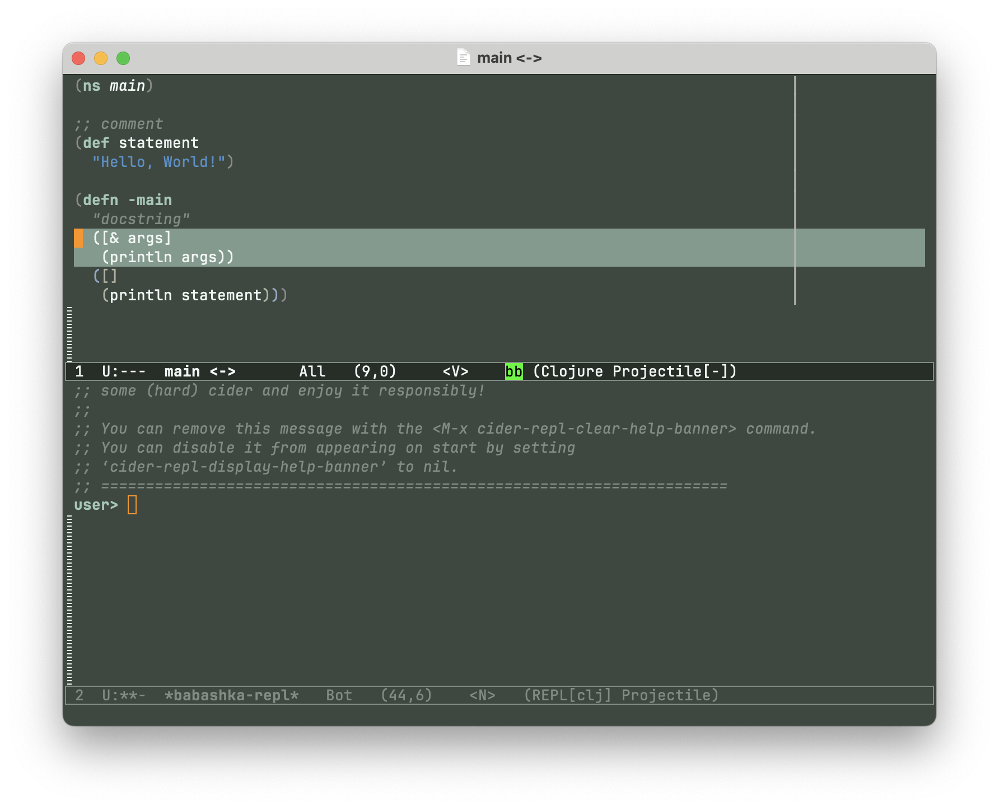
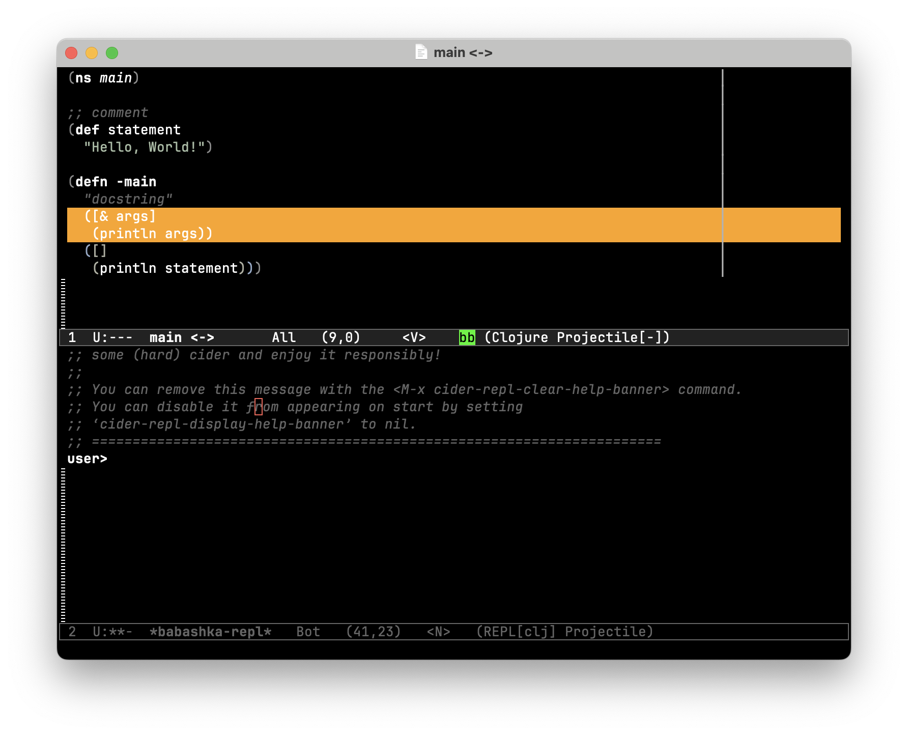
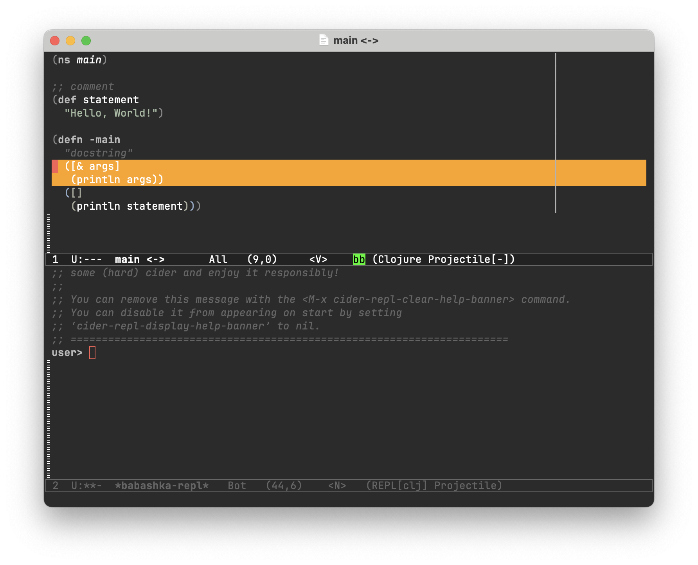
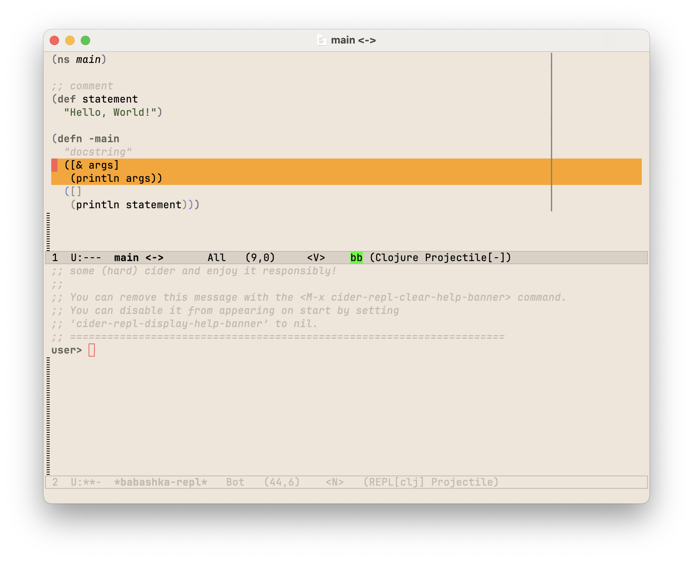

Almost mono themes
==================

A collection of almost monochrome emacs themes in a couple of variants.







Installation
============

Use package
-----------
If you have use-package setup on your system loading almost-mono-themes is as simple as:

```lisp
(use-package almost-mono-themes
  :straight (almost-mono-themes
             :type git
             :host github
             :repo "mjhika/almost-mono-themes")
  :config
    ;; (load-theme 'almost-mono-black t)
    ;; (load-theme 'almost-mono-gray t)
    ;; (load-theme 'almost-mono-cream t)
    ;; (load-theme 'almost-mono-white t)
    (load-theme 'almost-mono-green t))
```

Manual installation
-------------------
If you prefer, you can install almost-mono-themes manually by downloading the elisp files in this repo and place them somewhere in your <code>load-path</code> and <code>custom-theme-load-path</code> (see example below).

You can set your paths by adding these lines to your <code>.emacs.d</code> or <code>.emacs.d/init.el</code>:

```lisp
;; Put the main theme file almost-mono-themes.el in your load path
(add-to-list 'load-path "~/.emacs.d/elisp")

;; Put the induvidual theme files almost-mono-{black, white, etc.}-theme.el in your theme load path
(add-to-list 'custom-theme-load-path "~/.emacs.d/themes")
```

You should now be able to load almost-mono-themes with <code>M-x load-theme RET almost-mono-{black, white, etc.} RET</code>!
